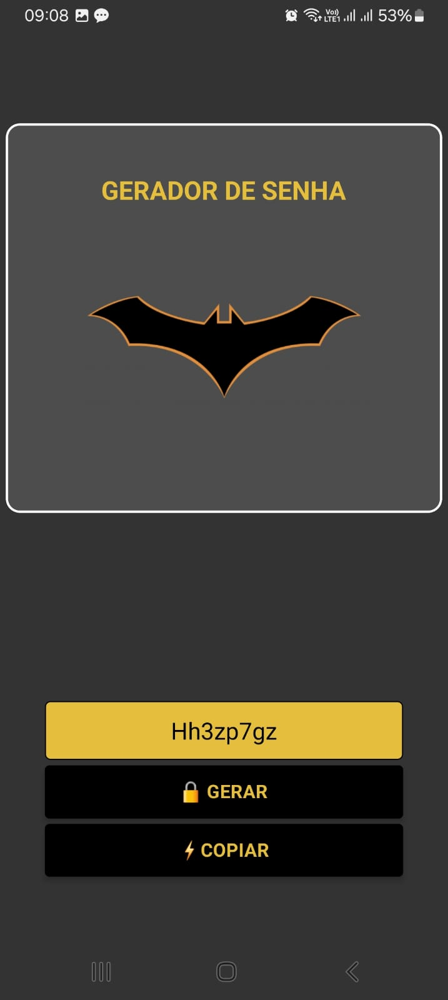

<h1 align="center"><strong> # 🦇 GERADOR DE SENHAS 🦇 </strong></h1>
Um aplicativo mobile simples, construído com React Native e Expo, para gerar senhas seguras e copia-las para área de transferência com um clique.

<div align="center">
  
</div>


## ✨ Funcionalidades

*   **Geração de Senhas:** Crie senhas aleatórias de 8 caracteres.
*   **Copiar para a Área de Transferência:** Botão "⚡ Copia" que copia a senha gerada instantaneamente.
*   **Interface Temática:** Layout inspirado no universo do Batman para uma experiência mais divertida.

---

## 🛠️ Tecnologias Utilizadas

Este projeto foi construído utilizando as seguintes tecnologias:

*   **[React Native](https://reactnative.dev/ )**: Framework para desenvolvimento de aplicativos móveis multiplataforma.
*   **[Expo](https://expo.dev/ )**: Plataforma e conjunto de ferramentas para facilitar o desenvolvimento e a publicação de apps React Native.
*   **[TypeScript](https://www.typescriptlang.org/ )**: Superset do JavaScript que adiciona tipagem estática ao código.
*   **Git & GitHub**: Para versionamento e hospedagem do código.

---

## 🚀 Como Executar o Projeto

Para rodar este projeto localmente, siga os passos abaixo.

**Pré-requisitos:**
*   [Node.js](https://nodejs.org/en/ ) instalado.
*   [Git](https://git-scm.com/ ) instalado.
*   O aplicativo **Expo Go** instalado no seu celular.

**Passos:**

1.  **Clone o repositório:**
    ```
    git clone https://github.com/NatyAnalytcs-1/APP-Gerador-senhas.git
    ```

2.  **Navegue até a pasta do projeto:**
    ```
    cd APP-Gerador-senhas
    ```

3.  **Instale as dependências:**
    ```
    npm install
    ```

4.  **Inicie o servidor de desenvolvimento:**
    ```
    npx expo start
    ```

5.  **Abra no seu celular:**
    Após o comando acima, um QR Code aparecerá no terminal. Abra o aplicativo **Expo Go** no seu celular e escaneie o QR Code para carregar o app.

---

## 📂 Estrutura de Pastas

O projeto está organizado da seguinte forma para manter o código limpo e modular:

```
├── assets/             # Imagens 
├── src/
│   ├── components/     # Componentes reutilizáveis (Botões, Inputs, Logo )
│   ├── screens/        # Telas principais do aplicativo (Home)
│   └── services/       # Lógica (gerador de senhas)
├── App.tsx             # Ponto de entrada principal do app
└── package.json        # Dependências e scripts do projeto
```

🧠 Feito com café ☕ por Naty
